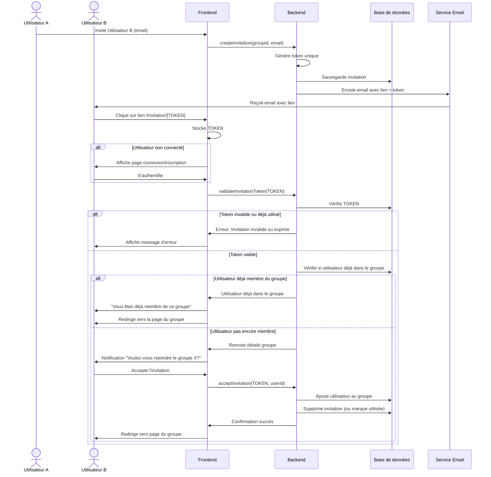

```mermaid
sequenceDiagram
    actor UA as Utilisateur A
    actor UB as Utilisateur B
    participant F as Frontend
    participant B as Backend
    participant DB as Base de données
    participant Mail as Service Email

    UA->>F: Invite Utilisateur B (email)
    F->>B: createInvitation(groupId, email)
    B->>B: Génère token unique
    B->>DB: Sauvegarde invitation
    B->>Mail: Envoie email avec lien + token
    Mail->>UB: Reçoit email avec lien

    UB->>F: Clique sur lien /invitation/[TOKEN]
    F->>F: Stocke TOKEN
    alt Utilisateur non connecté
        F->>UB: Affiche page connexion/inscription
        UB->>F: S'authentifie
    end
    
    F->>B: validateInvitationToken(TOKEN)
    B->>DB: Vérifie TOKEN
    
    alt Token invalide ou déjà utilisé
        B->>F: Erreur: Invitation invalide ou expirée
        F->>UB: Affiche message d'erreur
    else Token valide
        B->>DB: Vérifie si utilisateur déjà dans le groupe
        alt Utilisateur déjà membre du groupe
            B->>F: Utilisateur déjà dans le groupe
            F->>UB: "Vous êtes déjà membre de ce groupe"
            F->>UB: Redirige vers la page du groupe
        else Utilisateur pas encore membre
            B->>F: Renvoie détails groupe
            F->>UB: Notification "Voulez-vous rejoindre le groupe X?"
            UB->>F: Accepte l'invitation
            F->>B: acceptInvitation(TOKEN, userId)
            B->>DB: Ajoute utilisateur au groupe
            B->>DB: Supprime invitation (ou marque utilisée)
            B->>F: Confirmation succès
            F->>UB: Redirige vers page du groupe
        end
    end
```