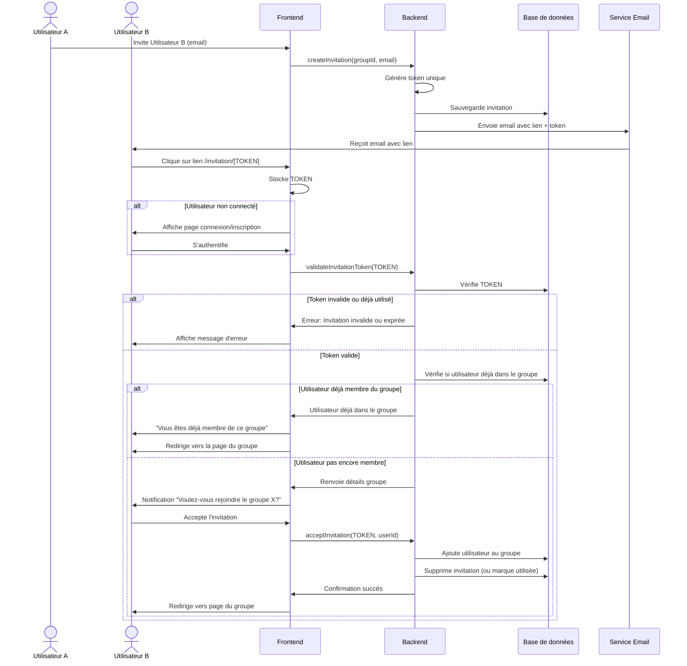
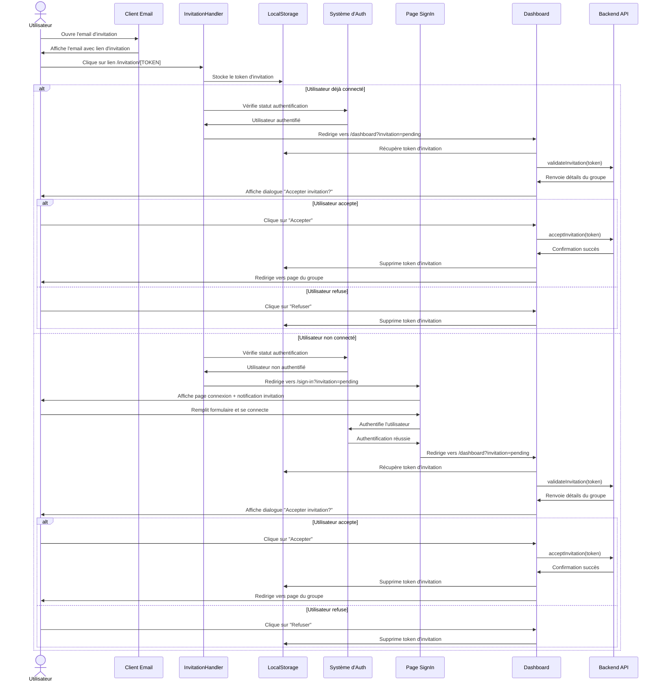

# Système d'Invitation de Groupe

Cette documentation présente le système d'invitation de groupe de l'application GiftWhisper, avec une attention particulière sur la gestion des invitations par email.

## Vue d'ensemble du processus

Le diagramme suivant illustre l'ensemble du processus d'invitation, de la création de l'invitation jusqu'à l'acceptation par l'utilisateur invité.

## Détail de l'implémentation frontend

Le diagramme suivant détaille spécifiquement l'implémentation frontend du processus d'acceptation d'invitation :

## Explication technique

1. **Gestion du token d'invitation**:
   - Le token est transmis via l'URL (/invitation/[TOKEN])
   - La route est interceptée par le composant InvitationHandler
   - Le token est stocké dans localStorage pour le persister à travers les redirections

2. **Processus d'authentification**:
   - Si l'utilisateur n'est pas connecté, il est redirigé vers la page de connexion
   - Le paramètre URL "?invitation=pending" est utilisé pour indiquer une invitation en attente afin d'afficher un message personnalisé à l'utilisateur 
   - Après connexion, l'utilisateur est redirigé vers le dashboard avec l'invitation toujours en attente

3. **Validation et acceptation**:
   - Le Dashboard détecte le paramètre "?invitation=pending"
   - Il récupère le token depuis localStorage
   - Il valide le token auprès du backend en faisant appel à la méthode prévue à cet effet 
   - Il affiche une boîte de dialogue permettant à l'utilisateur d'accepter ou refuser l'invitation
   - En cas d'acceptation, l'utilisateur est ajouté au groupe et redirigé vers la page du groupe
   - L'invitation est supprimée en base de donnée

Cette implémentation assure une expérience utilisateur fluide tout en maintenant un niveau de sécurité élevé pour le processus d'invitation.